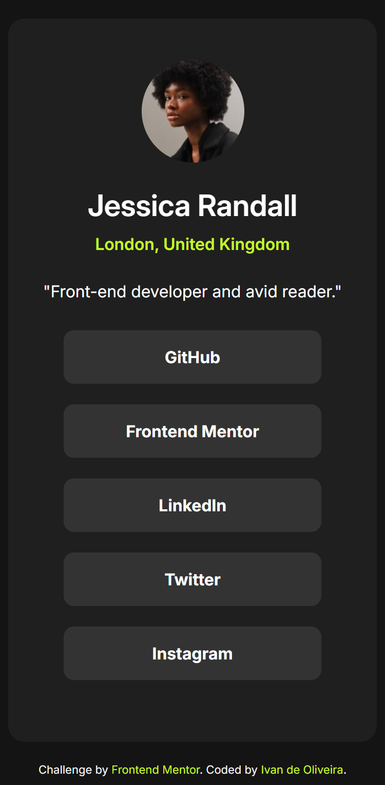

# Frontend Mentor - Social links profile solution

This is a solution to the [Social links profile challenge on Frontend Mentor](https://www.frontendmentor.io/challenges/social-links-profile-UG32l9m6dQ). Frontend Mentor challenges help you improve your coding skills by building realistic projects.

## Overview

### The challenge

Users should be able to:

- See hover and focus states for all interactive elements on the page

### Screenshot

- Desktop version
  

- Mobile version
  

### Links

- Solution URL: [Add solution URL here](https://your-solution-url.com)
- Live Site URL: )

## My process

### Built with

- Semantic HTML5 markup
- CSS custom properties

## Author

- Gitgub - [Ivan de Oliveira](https://github.com/ivandoliveira)
- Frontend Mentor - [@ivandoliveira](https://www.frontendmentor.io/profile/ivandoliveira)
- Twitter - [@\_ivanzo](https://x.com/_ivanzo)
